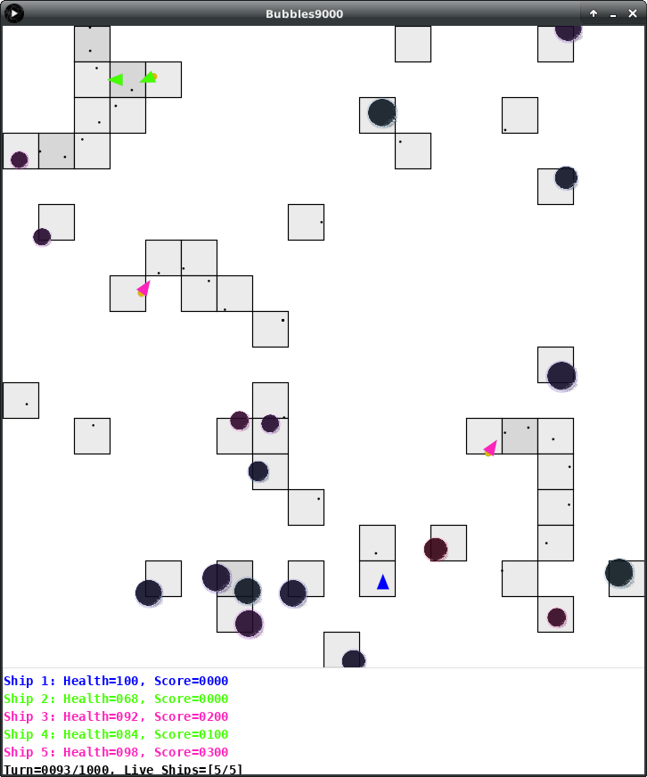

# Bubbles 9000
Bubbles9000 is a very simple game developed as learning aid and to serve as a test platform in exploring some basic AI / machine learning concepts. The game was developed using [Processing](https://processing.org/). Aim of the game is to shoot the bubbles that float around on screen and not die. You can also shoot other players for points. There can be 1-N players depending on configuration.

## Starting the Game
On windows run the application `./Bubbles9000/application.windows32/Bubbles9000.exe`

On Linux run the application `./Bubbles9000/application.linux64/Bubbles9000`

No other system supported.

## Rules Summary

  * +100 points for shooting and popping a bubble.
  * +500 points for shooting and killing another ship.
  * Score set to -500 if killed.
  * All ships start with +100 health. Ship is considered killed if health is 0.
  * Ships are bound inside a 2D world and bounce of walls, bubbles and each other.
  * Bumping into a bubble or ship causes both to loose health. The angle of attack and velocity effects how much health is reduced.

## Ship Controls
There are four controls of a ship:

  * Steer left.
  * Steer right.
  * Thrust forward.
  * Shoot.

There is no limit to how much you can shoot, and no penalty for shooting continuously (there probably should be. Todo in v2).

## Autonomous Ship Inputs
Autonomous ships are feed 4 input which they use to decide which ship controls to activate.

  * Distance to the nearest ship.
  * Angle to the nearest ship.
  * Distance to the nearest bubble.
  * Angle to nearest bubble.

Angles range from [-PI+PI/8,PI-PI/8] and is 0 when the target is directly in front.

## Autonomous Ship Training
Two methods were used.

  * Offline evolutionary method: A number of ships compete over a number of iterations to build up a pool of <config, score> pairs. These pairs are then evolved over a number of generations.
  * Online supervised: The game is start with one human player and another computer player. The computer player trains it's neural net given the live input from the human player.

## Neural Network Used
I just used a perceptron network with 4 inputs and 4 outputs.

# Source Code Overview

  * Bubbles9000/
      Processing application including pre trained neuron configurations, and a build of the final application for Window and Linux.
  * ShipEvolver/
      Scripts used to evolve neuron configurations offline.
  * README.md
      This file.
  * pres.mp4
      Video presentation.
